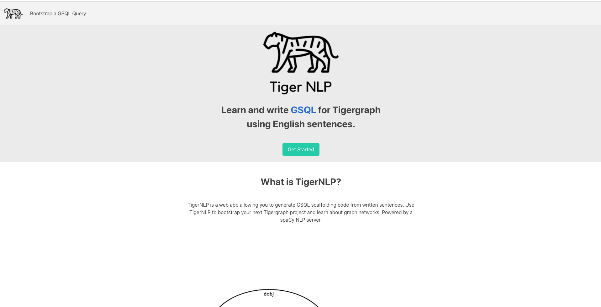
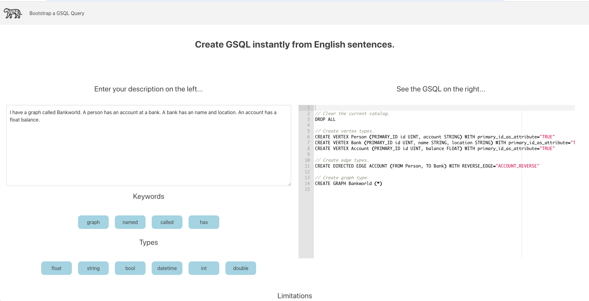

    

# TigerNLP

Generate GSQL from human sentences.

Currently a prototype. Built for the Tigergraph Graphathon challenge https://tigergraph2020.devpost.com/

Tigergraph GSQL generation based on human input text. Open source, and deployed version available.

Built for improving accessibility and build tools for Tigergraph.

### Limitations

Note this project currently isn't a complete representation of the GSQL language. Sentences are expected to have one subject and possible multiple direct objects or actions. Tiger NLP will currently identify the following constructs:

<pre>
    Vertices
    Directed edges
    Undirected edges
    Vertex properties
    Edge properties
    Graph
</pre>

An item is considered a property if it is not used in a vertex capacity. i.e. for elements that are defined using 'has a', they would be considered a vertex if we could derive an edge from it but a property otherwise.

## Client

The client is the user-facing website.

From the `tiger-nlp` client directory:

<pre>
    yarn
    yarn start
</pre>

## Server

The backend runs a flask server that serves the model for generating GSQL from english sentences.

From the `./server` directory:

<pre>
    pip install -r requirements.txt
    python3 -m spacy download en_core_web_sm
    flask run
</pre>

### Screenshots

#### Home

#### Creating a schema

### Distinguishing vertices from properties.

### Dev Notes

- Get started with Tigergraph: https://docs.tigergraph.com/start/get-started-with-tigergraph
- Get started with spaCy: https://spacy.io/
- Tigergraph GSQL language spec: https://docs-beta.tigergraph.com/dev/gsql-ref/querying/appendix-query/complete-formal-syntax-for-query-language
- Define the schema: https://docs.tigergraph.com/start/gsql-102/define-the-schema

### References

- https://www.researchgate.net/publication/258650012_Generating_UML_Diagrams_from_Natural_Language_Specifications
